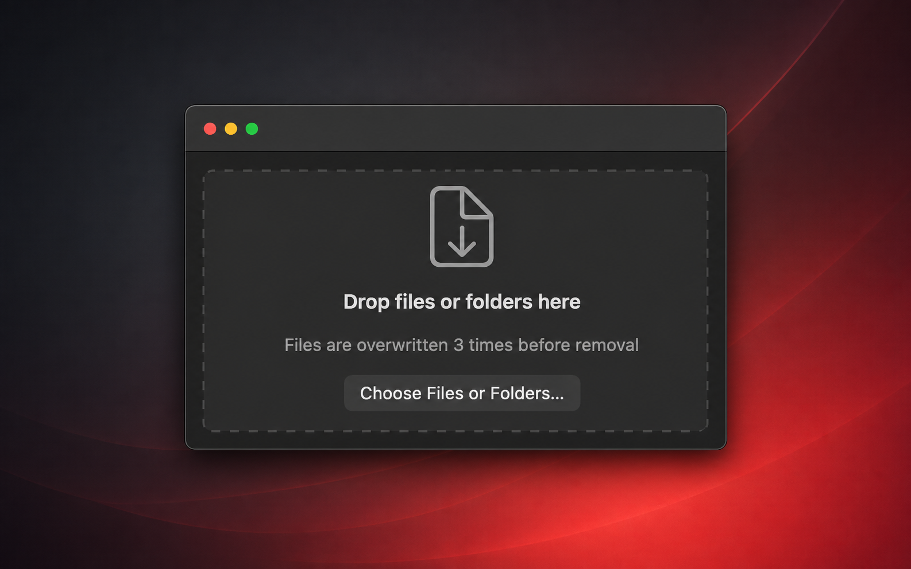

# Shredder

A native macOS utility that securely overwrites files and folders before removing them.



## [Download for macOS](https://github.com/Alyetama/Shredder/releases/latest/download/Shredder.dmg)

## Features

- Drag-and-drop files and folders for recursive shredding.
- Choose 1, 3, or 7 overwrite passes.
- Use alternating patterns or cryptographically random data on every pass.
- Sync, truncate, optionally obfuscate filenames, and unlink files.
- Never follows symbolic links.
- Clear confirmation before destructive work begins.

> APFS copy-on-write, SSD wear-leveling, snapshots, and backups may retain earlier copies. For stronger protection, enable FileVault before sensitive data is written and securely erase the entire device when retiring it.

## First launch

Shredder is not signed with an Apple Developer ID, so macOS may block it the first time you open it.

1. Right-click (or Control-click) **Shredder.app**, choose **Open**, then click **Open**.
2. If that is blocked on newer macOS versions, open **System Settings → Privacy & Security**, scroll down, and click **Open Anyway** for Shredder.
3. Terminal fallback:

   ```bash
   /usr/bin/xattr -d com.apple.quarantine /Applications/Shredder.app
   ```

## Build from source

Requires macOS 14 or later and Xcode with the Swift 6 toolchain.

```bash
./scripts/build-app.sh
open dist/Shredder.app
```

Run the test suite with `swift test`.

## License

Shredder is available under the [MIT License](LICENSE).
